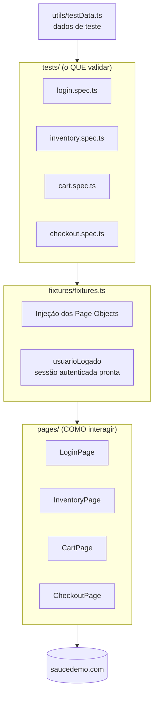

# Playwright QA Framework

Framework de testes E2E de nível produção construído com **Playwright + TypeScript**, aplicando **Page Object Model**, **fixtures reutilizáveis** e **CI/CD com GitHub Actions**. A aplicação sob teste é o [Sauce Demo](https://www.saucedemo.com), site público mantido pela Sauce Labs para prática de automação.

## Stack

| Camada | Tecnologia |
| --- | --- |
| Test runner | @playwright/test |
| Linguagem | TypeScript (strict) |
| Padrão de arquitetura | Page Object Model + custom fixtures |
| Relatórios | HTML reporter + list reporter |
| Evidências de falha | Trace on-first-retry + screenshot on failure |
| CI | GitHub Actions (Node 20, chromium) |

## Arquitetura do framework

```
playwright-qa-framework/
├── playwright.config.ts   # baseURL, retries, trace, reporters, testIdAttribute
├── pages/                 # Page Objects (locators + métodos de negócio)
│   ├── LoginPage.ts
│   ├── InventoryPage.ts
│   ├── CartPage.ts
│   └── CheckoutPage.ts
├── fixtures/
│   └── fixtures.ts        # injeção dos POs + fixture usuarioLogado
├── utils/
│   └── testData.ts        # credenciais, produtos e gerador de dados
├── tests/                 # specs organizados por funcionalidade
│   ├── login.spec.ts
│   ├── inventory.spec.ts
│   ├── cart.spec.ts
│   └── checkout.spec.ts
└── .github/workflows/tests.yml
```



### Decisões de design

- **Page Object Model**: cada página expõe métodos de negócio (`addToCart`, `proceedToCheckout`) em vez de cliques crus. Mudou o seletor? Corrige-se em um lugar só.
- **Locators robustos**: o Sauce Demo expõe atributos `data-test`; o config define `testIdAttribute: 'data-test'`, então os POs usam `getByTestId()` e `getByRole()` — resistentes a mudanças de CSS/layout.
- **Fixtures customizadas**: os specs recebem os Page Objects prontos por injeção. A fixture `usuarioLogado` entrega a sessão já autenticada, eliminando repetição de login nos testes que não são de login.
- **Dados de teste sem dependência extra**: `utils/testData.ts` centraliza credenciais/produtos e gera dados de checkout aleatórios por execução (faker leve caseiro).

## Como rodar

### Local

```bash
npm ci
npx playwright install chromium

npm test              # suíte completa, headless
npm run test:headed   # com browser visível
npm run report        # abre o relatório HTML da última execução
```

### CI

O workflow `.github/workflows/tests.yml` roda a cada push/PR na `main`:

1. Checkout + Node 20 (com cache de npm)
2. `npm ci` e `npx playwright install --with-deps chromium`
3. `npx playwright test` (com `retries: 1` — só no CI)
4. Upload do relatório HTML como artifact (mesmo em falha, via `if: always()`)

## Estratégia de testes

Seguindo a pirâmide de testes, a camada E2E deve ser **enxuta e de alto valor**: unidade e integração cobrem regras de negócio isoladas; aqui automatizamos apenas as **jornadas críticas do usuário**, onde uma quebra significa perda direta de receita ou acesso:

- **Autenticação** — porta de entrada: sucesso, credencial inválida e usuário bloqueado (caminhos felizes *e* de erro, pois mensagens de erro também são contrato com o usuário).
- **Catálogo** — listagem íntegra, ordenação por preço e adição ao carrinho.
- **Carrinho** — consistência entre badge, lista e remoção de itens.
- **Checkout** — o fluxo completo de compra até "Thank you for your order!" e a validação de campos obrigatórios.

Critérios usados para decidir o que automatizar em E2E: criticidade para o negócio, frequência de uso, custo de falha em produção e estabilidade do fluxo. Casos de borda de baixo impacto ficam para camadas mais baratas da pirâmide.

## Métricas de qualidade

Duas métricas guiam a saúde da suíte:

- **Pass rate** (`testes aprovados / testes executados`): mede a saúde do produto **e** da suíte. Queda de pass rate sem mudança funcional é sinal de teste frágil, não de bug.
- **Flaky rate** (`testes que passaram apenas no retry / testes executados`): mede a confiabilidade da suíte. Teste flaky corrói a confiança do time no sinal do CI — flakiness alta é tratada como bug de automação, com prioridade.

Como o framework instrumenta essas métricas:

- **`retries: 1` no CI**: um teste que falha e passa no retry é marcado como *flaky* no relatório do Playwright (em vez de simplesmente "passou"). Isso torna a flakiness **visível e mensurável** ao invés de mascarada.
- **`trace: 'on-first-retry'`**: exatamente no cenário de flakiness, o Playwright grava o trace completo da reexecução — screenshots passo a passo, snapshots do DOM, chamadas de rede e console. Abrindo o trace (`npx playwright show-trace`), investiga-se a causa raiz (race condition, espera implícita ausente, instabilidade do ambiente) sem precisar reproduzir localmente.
- **Relatório HTML como artifact no CI**: cada execução preserva evidências; o histórico de artifacts permite acompanhar tendência de pass/flaky rate ao longo do tempo.

Localmente `retries: 0` — falha local deve falhar de verdade, para não esconder problema durante o desenvolvimento.

## Autor

**Matheus Raul** — engenheiro de automação (RPA e QA) com foco em Python/TypeScript e Playwright.
